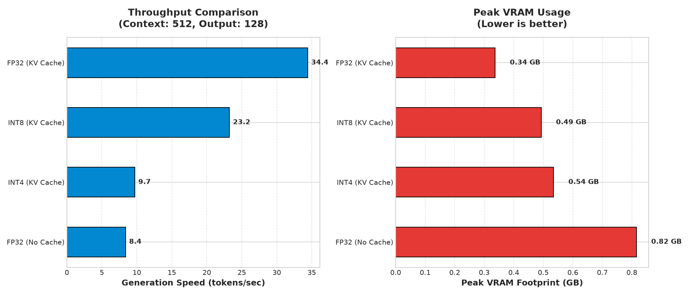

# Inference Optimization Engine

A high-performance LLM inference optimization engine designed, implemented, and benchmarked to explore modern serving bottlenecks and optimization strategies. This project houses my custom implementations of KV-caching, low-bit weight quantization, iteration-level continuous batching, and speculative decoding.

---

## 🚀 Overview

Serving Large Language Models (LLMs) at scale is heavily bound by memory bandwidth and compute latency. To understand and address these bottlenecks, I built this inference engine to implement and benchmark core optimization techniques from scratch.

This engine includes:
- **Dynamic Key-Value (KV) Caching** (reducing decoding complexity from $O(N^2)$ to $O(N)$)
- **Low-Bit Weight Quantization** (INT8 and INT4 weight-only quantization)
- **Iteration-Level Continuous Batching** (reducing queue delays and improving GPU utilization)
- **Speculative Decoding** (accelerating target models with parallel draft verification)

---

## 🛠️ Architecture & Key Features

### 1. KV Cache & Rollback Mechanics
In autoregressive generation, calculating attention over all past tokens at every step is highly redundant. I implemented a dynamic KV caching mechanism that stores past keys and values.
* **Rollback Mechanics**: Essential for speculative decoding, the KV cache supports sequence slicing to discard rejected candidate tokens and rollback both the target verifier and draft model KV cache states cleanly.
* **Compatibility**: Supports both custom tensor shapes and Hugging Face's native `DynamicCache` structure.
* Detailed Design: Check out [`docs/kv_cache.md`](docs/kv_cache.md).

### 2. Weight-Only Quantization (INT8 & INT4)
To combat memory bandwidth saturation, I implemented custom INT8 and INT4 linear layers.
* **Uniform Symmetric Quantization**: Dynamic scaling factors are calculated per-channel for weights, mapping FP32 weights to signed low-bit integer ranges.
* **Execution & Profiling**: I analyzed CPU vs. GPU performance and documented how dynamic dequantization in pure PyTorch (shifting, scaling, and casting back to FP32/BF16 at each step) introduces compute overheads unless compiled or fused into low-level CUDA kernels.
* Detailed Design: Check out [`docs/int8_quantization.md`](docs/int8_quantization.md) and [`docs/int4_quantization.md`](docs/int4_quantization.md).

### 3. Iteration-Level Continuous Batching
Traditional static batching waits for the longest request in a batch to finish, leaving shorter requests blocked and wasting GPU cycles.
* **FIFO Queue & Batch Manager**: Requests are queued and scheduled dynamically at the iteration level.
* **Dynamic Slot Assignment**: High-priority decode phases are integrated with incoming prefill phases, allowing finished requests to exit and new ones to join mid-run.
* Detailed Design: Check out [`docs/continuous_batching.md`](docs/continuous_batching.md).

### 4. Speculative Decoding Engine
To accelerate slow target model generation, I paired a large Target Model (Qwen2.5-3B) with a lightweight Draft Model (Qwen2.5-0.5B).
* **Draft Generation**: The draft model quickly proposes $K$ candidate tokens autoregressively.
* **Parallel Verification**: The target model runs verification on all $K$ candidates in a single forward pass.
* **Acceptance Logic**: Greedy token comparison evaluates candidates. When a candidate is rejected, the target model's corrected token is accepted, and both caches are rolled back.
* Detailed Design: Check out [`docs/speculative_decoding.md`](docs/speculative_decoding.md).

---

## 📂 Repository Layout

```bash
├── docs/                             # Detailed documentation & system design guides
│   ├── benchmarking.md               # Memory sweeps & latency logs
│   ├── profiling.md                  # Chrome tracing timelines & bottlenecks
│   ├── kv_cache.md                   # KV cache architecture
│   ├── int8_quantization.md          # INT8 quantization implementation
│   ├── int4_quantization.md          # INT4 quantization implementation
│   ├── continuous_batching.md        # Iteration-level scheduling details
│   └── speculative_decoding.md       # Target-Draft verification mechanisms
├── src/
│   ├── cache/                        # Cache manager logic
│   ├── decoder/                      # Autoregressive generator 
│   ├── models/                       # Model loader configurations
│   ├── profiling/                    # PyTorch profiling utilities
│   ├── quantization/                 # INT8 & INT4 linear layer definitions
│   ├── scheduler/                    # Queue and iteration-level scheduler
│   └── speculative/                  # Speculative verification & rollback
├── experiments/                      # Benchmarking & validation suites
│   ├── benchmark_kv.py
│   ├── benchmark_int8.py
│   ├── benchmark_int4.py
│   ├── run_batching_benchmarks.py
│   └── run_speculative_benchmarks.py
└── reports/                          # JSON results & profiling logs
```

---

## 🚦 Getting Started

### Prerequisites
Make sure you have PyTorch (with CUDA support) and Hugging Face Transformers installed.
```bash
pip install torch transformers accelerate
```

### Running the Validation and Benchmark Suites

I set up several experiment scripts to validate correctness and profile performance:

1. **Verify KV Cache Performance**:
   ```bash
   python -m experiments.benchmark_kv
   ```

2. **Run Weight-Only Quantization (INT8 & INT4) Benchmarks**:
   ```bash
   python -m experiments.benchmark_int8
   python -m experiments.benchmark_int4
   ```

3. **Benchmark the Continuous Batching Scheduler**:
   ```bash
   python -m experiments.run_batching_benchmarks
   ```

4. **Verify Speculative Decoding Speedup**:
   ```bash
   python -m experiments.run_speculative_benchmarks
   ```

---

## 📊 Summary of Benchmarking & Profiling



* **Memory Savings**: INT8 and INT4 quantization significantly reduce peak GPU VRAM requirements during model loading and generation.
* **Latency Tradeoffs**: Weight-only quantization in pure PyTorch results in dequantization overhead during matrix multiplication. To achieve a true wall-clock speedup, these operations need custom fused kernels (e.g., AWQ/GPTQ) to avoid the PyTorch tensor creation overhead at every layer.
* **Scheduling Efficiency**: Continuous batching dynamically schedules requests, maintaining steady GPU utilization and preventing resource fragmentation compared to static batching.

For a detailed walkthrough of memory consumption, execution timelines, and Chrome tracer profiles, see [`docs/benchmarking.md`](docs/benchmarking.md) and [`docs/profiling.md`](docs/profiling.md).
